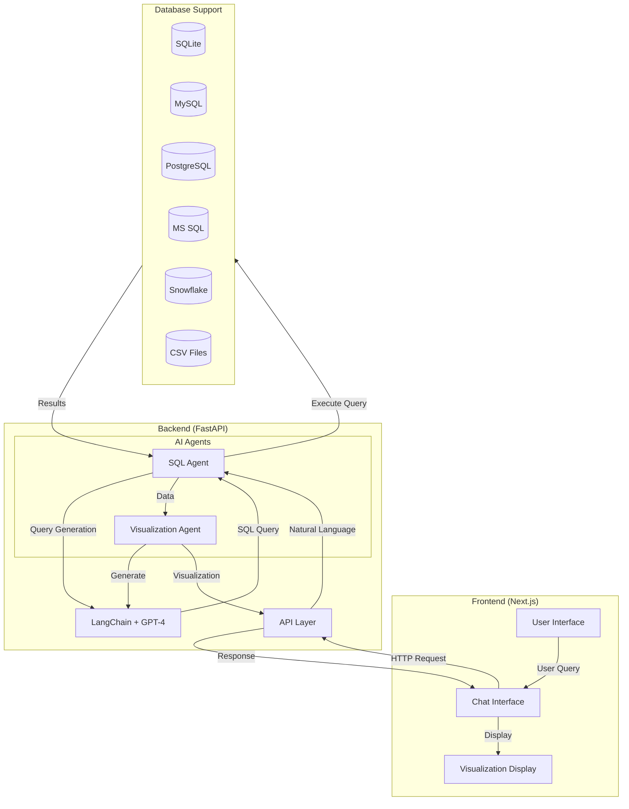

# TalkQL - Chat with Your Data
<div align="center" style="margin: 2rem 0;">
  <p align="center" style="font-size: 1.5rem; color: #4F46E5; margin-bottom: 1rem;">
    Turn conversations into insights with natural database interactions
  </p>
  <div align="center" style="display: flex; justify-content: center; gap: 1rem; margin-top: 1rem; flex-wrap: wrap;">
  <!-- Frontend -->
  
  
  
  
  
  
  
  
  
  
</div>
</div>

# Introduction

TalkQL revolutionizes how you interact with databases by enabling natural language conversations with your data. Simply chat with your database as if you're talking to a friend, and watch as your questions transform into powerful SQL queries. Get answers in plain English, complete with intuitive visualizations and clear explanations.

## UI Showcase

<div align="center">


</div>

## Table of Contents

- [Features](#features)
- [Architecture](#architecture)
- [Technologies Used](#technologies-used)
- [Installation](#installation)
- [Usage](#usage)
- [Contributing](#contributing)
- [Acknowledgements](#acknowledgements)
- [License](#license)

## Features

As referenced in the features component:

- 🔄 **Multi-Database Support**: Connect to SQLite, MySQL, PostgreSQL, MS SQL, Snowflake, and CSV files
- 💬 **Natural Language Processing**: Convert casual questions into precise SQL queries
- 📊 **Smart Visualizations**: Automatic data visualization with context-aware chart selection
- 📋 **Flexible Display Options**: Toggle between tabular and narrative formats
- 🔍 **Query Transparency**: View and understand the generated SQL
- 🎨 **Modern, Intuitive Interface**: Clean design with smooth transitions and animations

## Architecture

### Frontend
- Next.js application with React components
- Real-time chat interface
- Dynamic visualization rendering
- Responsive design with Tailwind CSS

### Backend
- FastAPI server handling request processing
- LangChain for natural language processing
- SQL query generation and optimization
- Visualization generation with matplotlib/seaborn
TalkQL follows a modern client-server architecture:



### Key Components
1. **SQL Agent**: Handles database connections and query processing
2. **Visualization Agent**: Creates context-aware data visualizations
3. **Chat Interface**: Manages user interactions and message display
4. **Database Connection Hub**: Supports multiple database types

## Technologies Used

### Frontend
- Next.js 15.0
- React 18
- Tailwind CSS
- Framer Motion
- TypeScript
- React Markdown

### Backend
- Python 3.8+
- FastAPI
- LangChain
- OpenAI GPT-4
- SQLAlchemy
- Matplotlib/Seaborn
- Pandas

## Installation

1. Clone the repository:
```bash
    git clone https://github.com/yourusername/TalkQL.git
    cd talkql
```

2. Install backend dependencies:
```bash
    cd backend
    python -m venv venv
    source venv/bin/activate # On Windows: venv\Scripts\activate
    pip install -r requirements.txt
```

3. Install frontend dependencies:
```bash
    cd frontend
    npm install
```

4. Set up environment variables:
(.env)
```bash
    OPENAI_API_KEY=your_api_key
```

## Usage

1. Start the backend server:
```bash
    cd backend
    uvicorn api:app --reload
```

2. Start the frontend development server:
```bash
    cd frontend
    npm run dev
```

3. Open your browser and navigate to `http://localhost:3000`

4. Connect your database using the connection interface

5. Start chatting with your data!

## Contributing

We welcome contributions! Please follow these steps:

1. Fork the repository
2. Create a feature branch (`git checkout -b feature/AmazingFeature`)
3. Commit your changes (`git commit -m 'Add some AmazingFeature'`)
4. Push to the branch (`git push origin feature/AmazingFeature`)
5. Open a Pull Request

## Acknowledgements

- OpenAI for GPT-4 API
- LangChain community
- All our contributors and users

## License

This project is licensed under the MIT License - see the [LICENSE](LICENSE) file for details.

---

<div align="left">
  Made with ❤️ 
</div>